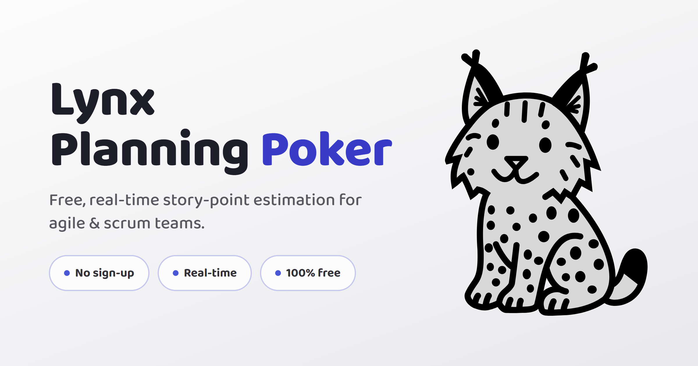

# Lynx Planning Poker

A real-time Planning Poker app for agile teams, built with **Elixir + Phoenix LiveView**. Create a room, share the link, vote on stories together — no accounts, no setup, no tracking cookies.



**Live demo:** <https://lynxplanningpoker.com>

## Features

- **Real-time voting** over Phoenix LiveView + PubSub — no polling, no page reloads
- **No accounts** — rooms are ephemeral, identified by a UUID link
- **Fibonacci deck** (0, 1, 2, 3, 5, 8, 13, 21, 34, 55, 89, ?)
- **Host controls** — reveal votes, reset round, end planning
- **Average calculation** when votes are revealed
- **Internationalization** — English (default), Portuguese (pt-BR), French, Spanish
- **Light / dark / system theme**
- **Privacy-first analytics** — first-party visit counting, no cookies, no third-party trackers
- **Anti-abuse** — Cloudflare Turnstile on room creation and per-IP rate limiting

## Tech stack

- **Elixir ~> 1.15** + **Phoenix 1.8**
- **Phoenix LiveView 1.1** for the reactive UI
- **PostgreSQL** via Ecto (UUID primary keys)
- **Tailwind CSS v4** + **esbuild**
- **Bandit** as the HTTP server
- **Playwright** for end-to-end tests

## Run locally

### Prerequisites

- Elixir >= 1.15
- PostgreSQL running on `localhost:5432` with user `postgres` / password `postgres` (or adjust [`app/config/dev.exs`](app/config/dev.exs))

A quick way to get Postgres up:

```sh
docker run --name postgres -e POSTGRES_PASSWORD=postgres -p 5432:5432 -d postgres:16
```

### First-time setup

```sh
cd app
mix setup
```

This runs `deps.get` → `ecto.create` → `ecto.migrate` → `run seeds.exs` → asset build.

### Start the dev server

```sh
mix phx.server
```

Open <http://localhost:4000>.

### Database commands

```sh
mix ecto.reset    # drop + recreate + migrate + seeds
mix ecto.migrate  # run pending migrations only
```

### Tests

**Unit + LiveView (ExUnit), from `app/`:**

```sh
mix test            # unit + LiveView tests
mix test --failed   # rerun only failed tests
mix precommit       # compile + format + deps.audit + sobelow + credo + dialyzer + test
```

**End-to-end (Playwright), from `e2e/`:**

Run against a Phoenix server already up at `localhost:4000` (start it with `mix phx.server` in another terminal). They drive a real browser through the full UI — they do **not** boot the app themselves.

```sh
cd e2e
npm install
npx playwright install   # first time only — downloads browser binaries

npm test                 # all specs, headless
npm run test:headed      # visible browser
npm run test:ui          # interactive Playwright UI
npm run report           # open the last HTML report
```

Specs cover the critical user flows: home/navigation, room creation, invite flow, voting, reveal/reset, multi-user real-time sync, host vs. guest actions, language switcher, and theme toggle. Full list and conventions in [`e2e/README.md`](e2e/README.md).

Point at another environment with `BASE_URL`:

```sh
BASE_URL=https://staging.example.com npm test
```

## Project layout

```
app/
  lib/
    lynxplanningpoker/        # Contexts: Rooms, Users, Analytics
    lynxplanningpoker_web/    # Controllers, LiveViews, components, plugs
  config/                     # config.exs, dev.exs, test.exs, prod.exs, runtime.exs
  priv/
    gettext/                  # en, pt_BR, fr, es translations
    repo/migrations/          # Ecto migrations
    static/                   # favicons, OG image, robots.txt
  test/                       # ExUnit + LiveView tests
e2e/                          # Playwright end-to-end tests
```

LiveView entry point for the game room: [`app/lib/lynxplanningpoker_web/live/room_live/show.ex`](app/lib/lynxplanningpoker_web/live/room_live/show.ex).

## How it works

1. The host creates a room at `/rooms/new` and chooses a name → a `Room` and a host `User` are created.
2. The host shares the `/rooms/invite/:id` link.
3. Each guest opens the link, picks a name, and is created as a `User` in the room.
4. Everyone lands on `/rooms/:id` (a LiveView). Votes, joins, and reveals broadcast over PubSub in real time.
5. When the host leaves, the room is closed for everyone (presence-aware).

## Deployment

The reference deployment runs on [Fly.io](https://fly.io). The [`app/fly.toml`](app/fly.toml) in this repo is the one used for the live demo — change `app =` and `PHX_HOST` before deploying your own copy.

## Contributing

Issues and pull requests are welcome. Before submitting:

- Run `mix precommit` inside `app/` and make sure it passes.
- If you change any user-visible string, run `mix gettext.extract --merge` and fill in the four `.po` files (`en`, `pt_BR`, `fr`, `es`). Keep the `msgid` in English (gettext's canonical source) and translate in each locale's `msgstr` — don't leave any `msgstr ""` empty.
- If your change affects UI, routes, or user flows, update or add the corresponding spec in [`e2e/tests/`](e2e/tests/).

## License

[MIT](LICENSE) © Fernando Martens
